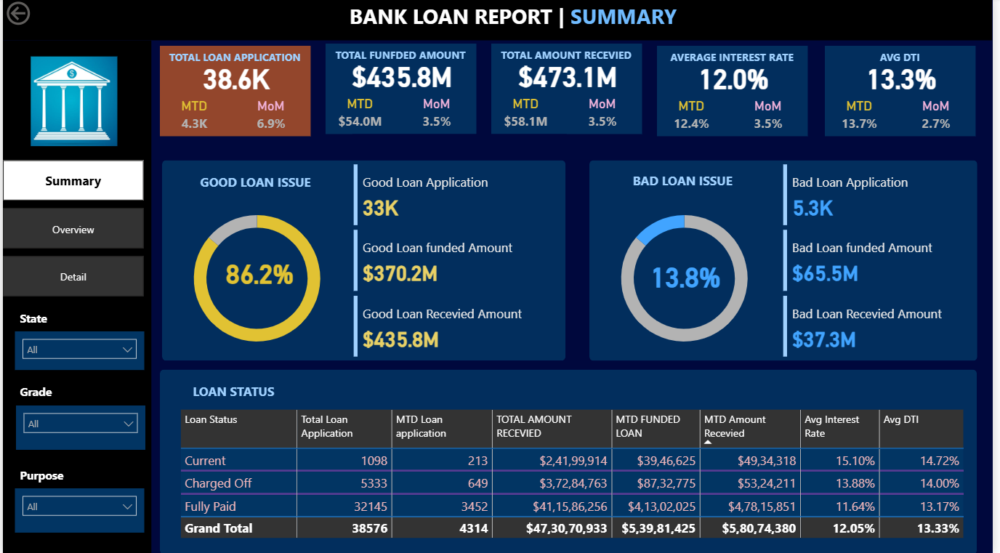
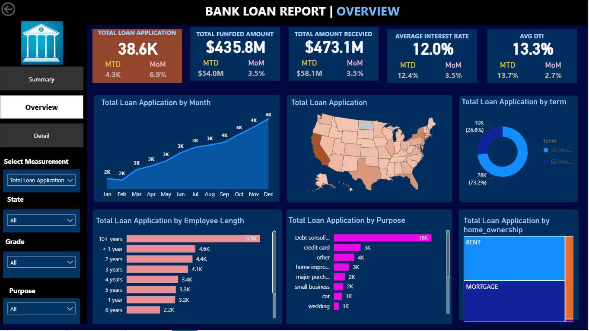

# Bank Loan Analysis Dashboard 📊 (Power BI + SQL)

## 🔹 Project Overview
This project presents an **end-to-end Bank Loan Analysis** using **SQL for data analysis** and **Power BI for interactive dashboard visualization**.  
The dashboard helps analyze loan performance, customer risk, and financial trends to support data-driven decision-making.

---

## 🛠 Tools & Technologies
- **Power BI** – Interactive dashboards & data visualization  
- **SQL (SQL Server / SSMS)** – Data querying and analysis  
- **DAX** – KPI calculations  
- **Excel / CSV** – Dataset  

---

## 📌 Key KPIs & Metrics
- Total Loan Applications  
- Month-to-Date (MTD) & Month-over-Month (MoM) analysis  
- Total Funded Amount  
- Total Amount Received  
- Average Interest Rate  
- Average Debt-to-Income (DTI)  
- Good Loan vs Bad Loan analysis  

---

## 📈 Dashboard Pages

### 🔹 Summary Page
Provides a high-level overview of loan performance:
- Good vs Bad loan percentage  
- Loan status (Current, Charged Off, Fully Paid)  
- Funded vs received amount comparison  

---

### 🔹 Overview Page
Displays overall trends and distribution:
- Monthly loan application trend  
- Loan distribution by state  
- Loan term analysis  
- Purpose-wise loan distribution  
- Home ownership impact on loans  

---

### 🔹 Detail Page
Provides granular loan-level details:
- Individual loan records  
- Interest rate, installment & received amount  
- Dynamic filters by state, grade, and purpose  

---

## 🧮 SQL Analysis
SQL was used to perform:
- Total and MTD loan application counts  
- Funded and received amount calculations  
- Average interest rate and DTI analysis  
- Month-over-month performance comparison  

SQL queries are available in:
